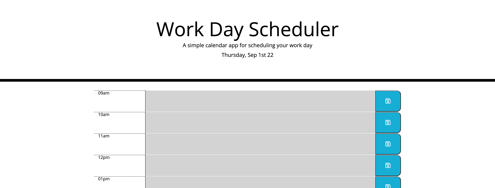

# Work Day Scheduler
A scheduler that helps to organize work during regular buisness hours.

## Built With
* HTML
* CSS
* JavaScript
* Bootstrap
* jQuery
* Moment.js

## Screenshot

## Purpose
The Work Day Scheduler is an easy to use tool for organizing tasks for each hour of a work day. It displays hours and events in the past, tasks requiring atttention in the present and upcoming tasks or events, all thanks to a color-coded design. Adding or removing a task requres clicking a 'save' button.

While working on this project, I learned that Moment.js is a great tool for adding calendar/time functionality to an application. I aslo learned to use jQuery to save user input in local storage and work with Bootsrap colomn component.

## Website

